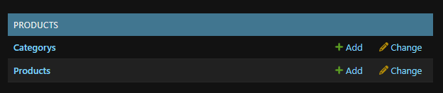

# Teste Infinix Fullstack

# Seção 1:

## Como rodar o projeto localmente

# Backend

### 1) Clone o repositório

```bash
git clone https://github.com/Leonardo-Watson/teste-infinix-fullstack.git .
```

### 2) Crie e ative o ambiente virtual (venv)

```bash
cd backend && python -m venv venv
```

Ative o venv:

```bash
source venv/Scripts/activate
```

### 3) Instale as dependências

```bash
pip install -r requirements.txt
```

### 4) Rode o servidor

```bash
python manage.py runserver
```

### 5) Crie e Aplique as Migrations

```bash
python manage.py makemigrations
python manage.py migrate
```

### 6) Crie um SuperUser

Exemplo: Username: Admin, Email:email@gmail.com, Senha: 123

```bash
python manage.py createsuperuser
```

### 7) Crie a categoria dos produtos

Acesse o link abaixo e faça login com o superuser criado:

```bash
http://localhost:8000/admin/login/?next=/admin/
```

### 8) Crie a categoria dos produtos

Acesse o link abaixo e faça login com o superuser criado:

```bash
http://localhost:8000/admin/login/?next=/admin/
```



Em Tagetorys clique em add e crie uma nova categoria

# Frontend

## Acessando o frontend

### 9) Crie a categoria dos produtos

Abra um segundo terminal

```bash
cd frontend && npm install
```

### 10) Rode o projeto, acesse o link e crie novos produtos

Acesse o link abaixo e faça login com o superuser criado:

```bash
npm run dev
```

```bash
http://localhost:5173/
```

# Seção 2:

Qual foi a maior dificuldade que você encontrou e como superou?

R: Não tinha tanto conhecimento com o django e usei a IA para entender alguns conceitos de como funcionava e para que servia

O que você não teve tempo de fazer (dentro do timebox) e como você faria se tivesse mais tempo?

R: Acabei criando a api com a estrutura base do projeto e não consegui ter tempo de criar um docker-compose, também não tive tempo de subir o projeto para a vercel, se eu tivesse mais tempo usaria mais a IA para algumas taferas mas não quis deixar muito genérico e sim com a minha cara.
